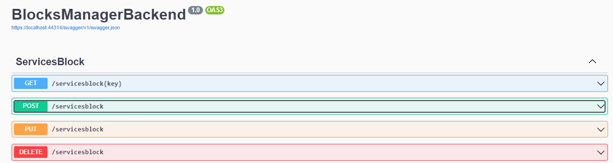
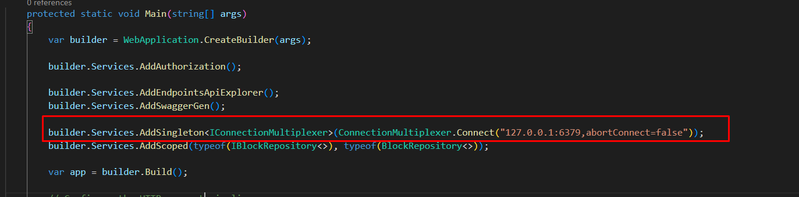

# BlocksManagerBackend

## About

Using  C# Generics with assembly, we have an excellent way to generate WebApis dynamically. 

So if a new model was necessary, we just needed to create a new class inheriting from Block, and the magic happens.
</br>
```
public class ServicesBlock : Block
{
    public override string ID => nameof(WebsiteHeroBlock);
    public string HeadlineText { get; set; }
    public List<ServiceCard> ServiceCards { get; set; }
}

```
</br>

</br>

## Setup
To run the project, you will need to set up the Redis 
</br>

</br>


